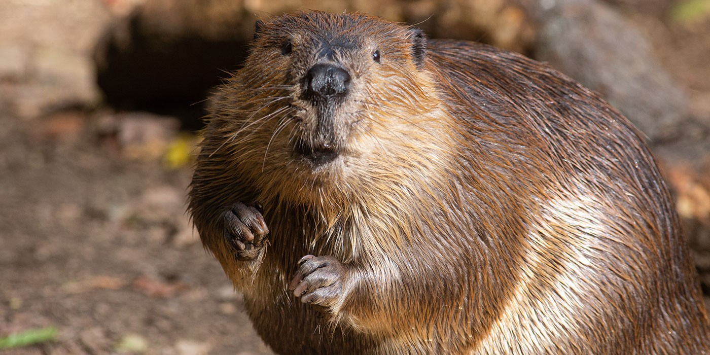

*This beaver lives at the Smithsonian National Zoo*

## Taxonomy

Class: Mammalia

Order: Rodentia 

Family: Castoridae

Genus and Species: *Castor canadensis*

## Diet

-

## Works Cited

1. Smithsonian’s National Zoo & Conservation Biology Institute. (2023, April 14). Beaver. Smithsonian’s National Zoo. <https://nationalzoo.si.edu/animals/beaver>
